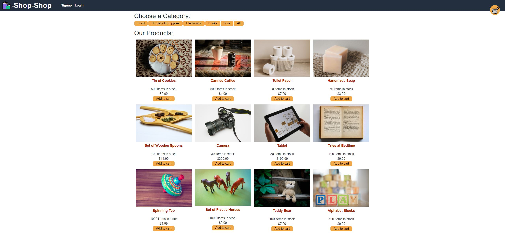

# Redux Store

## Description

My motivation for building this project was so that I could learn how to refactor an existing React application to use a redux store instead of the Context API.  I built this project in order to gain experience with how to use a redux store to globally keep track of the state of data, and thus make it easier to use in the application.  This project solves the problem of a user needing an online store to go to that has household items in stock, such as cookies, toilet paper and soap.  For this project, I learned how to create a Redux store with Redux Toolkit using slices.

## Table of Contents (Optional)

This README isn't that long, so N/A

## Installation

N/A

## Usage

This application is live on Heroku.  To use it, please go to the following link [https://damp-wildwood-87705-874e2a956b8f.herokuapp.com/](https://damp-wildwood-87705-874e2a956b8f.herokuapp.com/).

Here is a screenshot of the application: 

To actually place an order on the store, you will need to create an account.  To do this, click the Signup button in the black menu bar.  Here, you can enter your name, email address, and password.  Then, click the Submit button. So long as you have entered a unique email address and valid password, you will be logged into the application.  If you already have an account, click the Login button in the black menu bar, enter your credentials, and click Submit to log in.  

From the main page, if you wish to view a specific category of items, click one of the categorey buttons below the text 'Choose a Category:'.  You can add an item to your cart by clicking the 'Add to cart' button below any of the items.  Once an item is added to the cart, the cart will appear in the top right corner of the screen.  From there, you can remove items from the cart and also type in a new quantity for an item.  To close the cart, click the '\[close\]' button in the top right corner of the cart box.  When you are ready to check out, click the 'Checkout' button in the bottom right corner of the cart box.  

When you click the 'Checkout' button, you will need to wait a few seconds.  Then, you will be taken to a screen that allows you to pay with Stripe.  **Please note:**  This application uses Stripe in test mode, so you won't actually be paying for or buying anything.  To place a test order,  you can pay with Google Pay or Link, or you can enter your test card information.

If you wish to enter test card information, enter an email address, and then use the test card number **4242 4242 4242 4242**, enter a valid future date for the card expiration, and any three-digit number for the security code.  Then, enter a country or region, and a zip code and click the Pay button.  Your order should then go through.  If the order is successful, you will be redirected to the main store page.

## Credits

I used Redux toolkit documentation to help with writing the code.  This documentation can be found here: [https://redux.js.org/tutorials/fundamentals/part-8-modern-redux](https://redux.js.org/tutorials/fundamentals/part-8-modern-redux).

I also used the Xpert Learning Assistant AI chatbot to help with writing the code.

## License

This project is under an MIT license.  Please see the license in the repository for more information.

## Badges

I don't have any badges to display.

## Features

This project is an online store that allows users to create an account, log in, add items to a cart, and then enter payment information to pay for them with Stripe, using mock payment data.  Note that because this project's integration of Stripe payment software is in test mode, no credit cards are actually charged and transfer of money doesn't actually take place. 

## How to Contribute

This was a project I personally completed, so N/A.

## Tests

N/A
